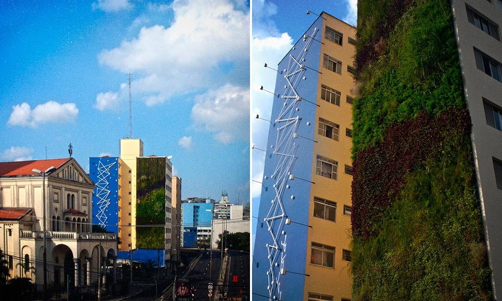
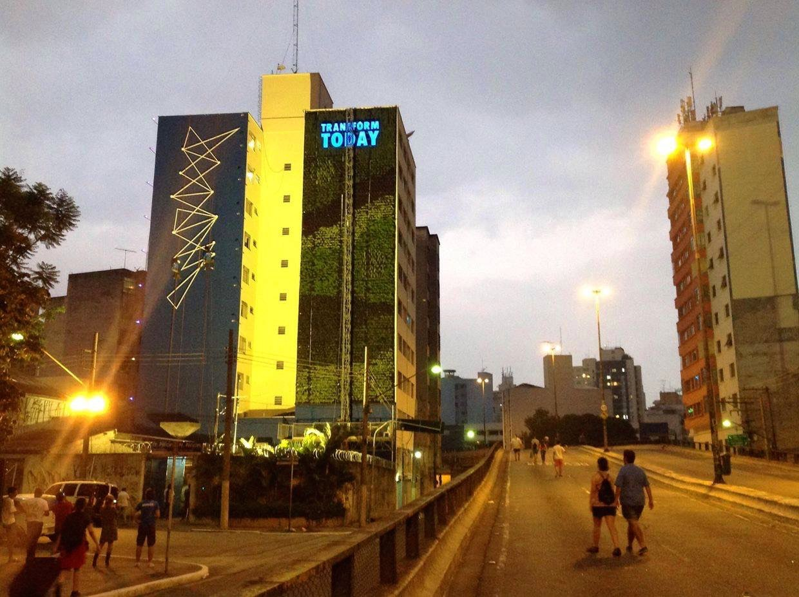
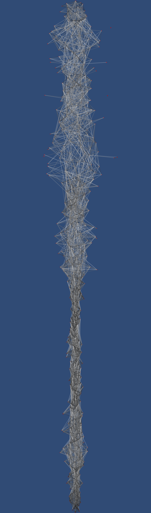
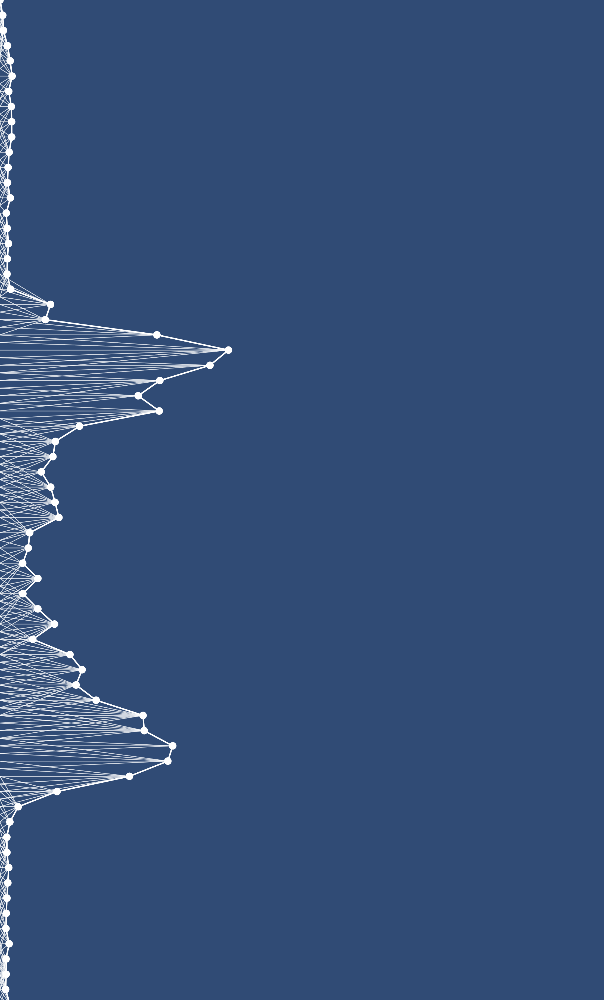
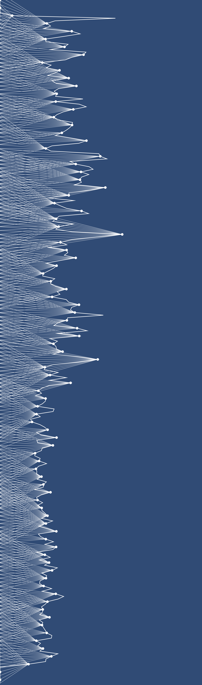

# Generative Design Facade

Made in collaboration with studends from [Escola Sao Paulo](https://www.behance.net/gallery/13489389/Intervencao-Absolut/)

Generative design visualization, based on the sounds around the building in São Paulo, surroundings of Minhocão.

 
 

##Experiments

 

 

 

 

